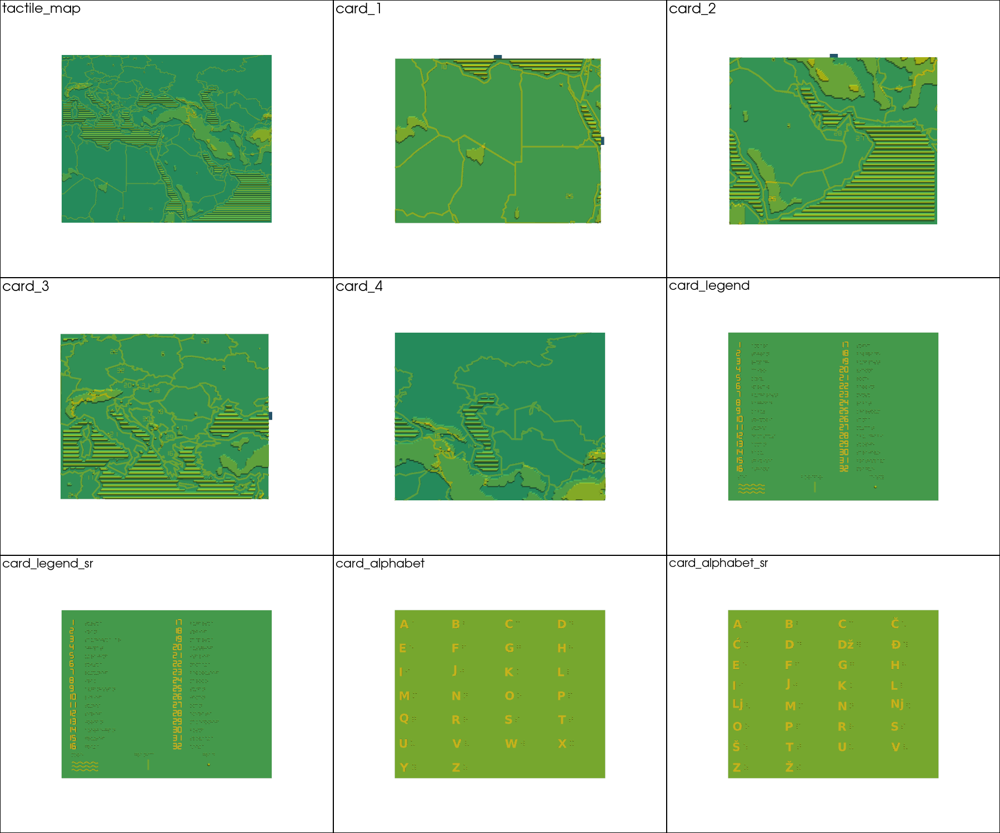
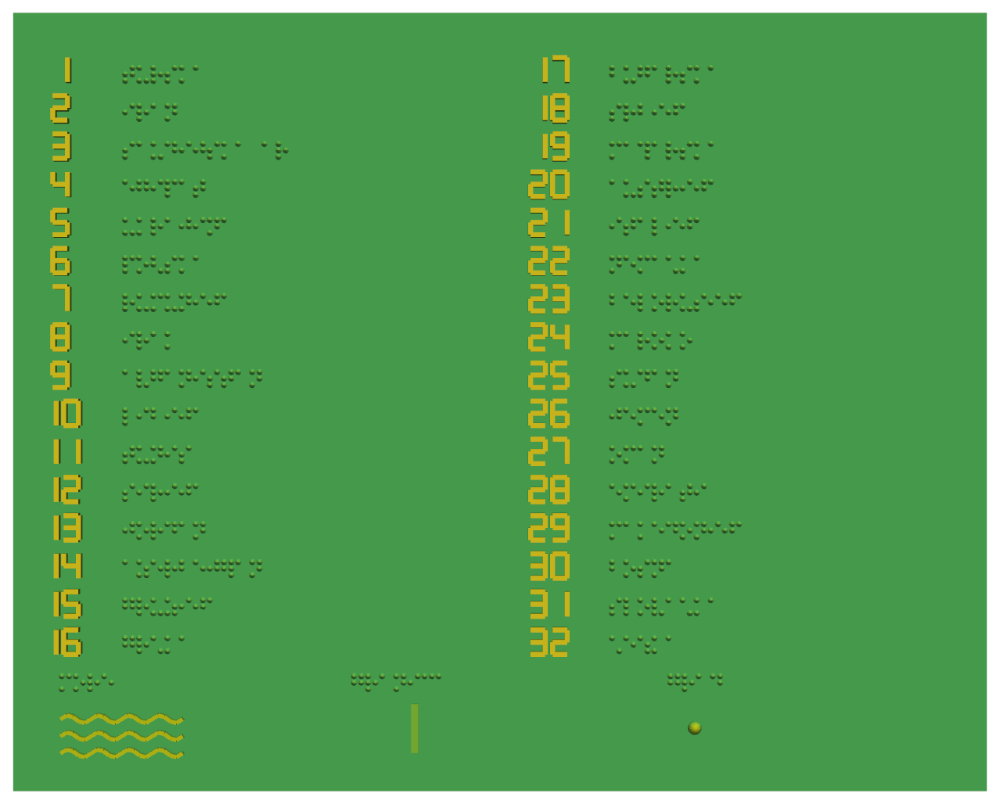
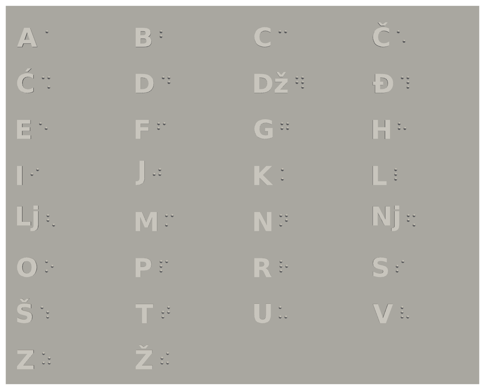
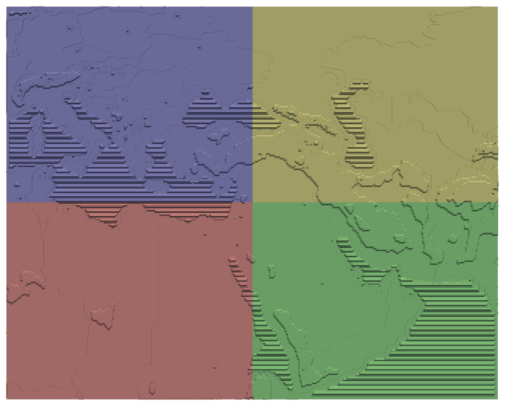
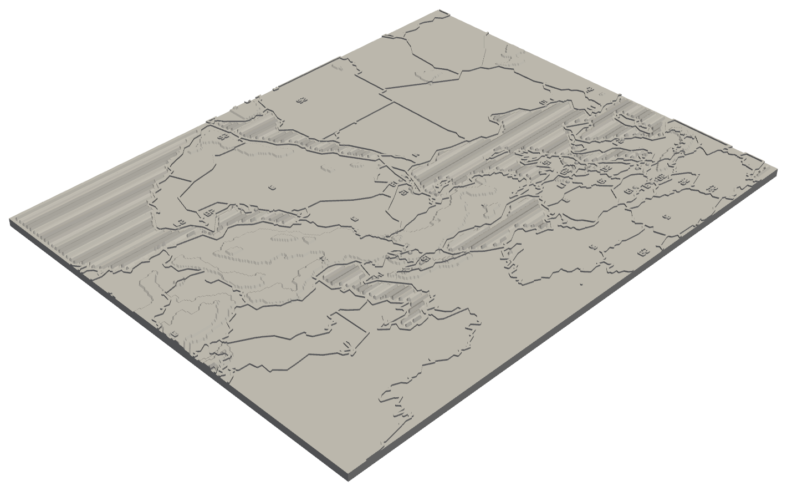

# Blind Map — Tactile Map for the Visually Impaired


A 3D-printable tactile map that helps blind people learn geography by touch.


## What is this?

This project generates STL files for 3D printing a tactile map. The map is
designed so a blind person can:

| What | How it feels |
|------|--------------|
| Country borders | Raised ridge (1.2 mm) that follows the terrain under the finger |
| Terrain | 4 tactile plateaus: sea / lowland / plateau / mountains (0/1/2/3 mm) |
| Sea | Wavy texture |
| Capitals | Small bumps |
| Country numbers | Raised 7-segment digits (like a calculator), 1–32 |
| Legend | Braille country list + texture samples (sea, border, city) |
| Alphabet cards | Raised Latin letter next to its braille cell, for learning braille |

The map splits into 4 puzzle pieces (200×160 mm each) that snap together with
tabs and slots. Legends and alphabet cards come in two languages: English and
Serbian (Gajica braille, 30 letters including Č Ć Dž Đ Lj Nj Š Ž).


## What You Get

9 print-ready STL files in `data/output/printready/`:

| File | Contents |
|------|----------|
| `tactile_map.stl` | The full 400×320 mm map in one piece |
| `card_1.stl` … `card_4.stl` | The same map split into 4 puzzle cards |
| `card_legend.stl` | Numbers 1–32 → capital names in English braille |
| `card_legend_sr.stl` | Numbers 1–32 → country names in Serbian braille |
| `card_alphabet.stl` | English braille alphabet learning card (26 letters) |
| `card_alphabet_sr.stl` | Serbian braille alphabet learning card (30 letters) |



Every output is a single watertight two-manifold, verified by
`mesh_diagnostics.py` — no inverted normals, internal cavities, or
self-intersections.

## Region Covered

Europe, Middle East, North Africa, Caucasus: 5°–70° E, 12°–55° N.
32 countries get a tactile number; countries too small for a raised digit
are marked with their capital bump only.




## How to Build

### 0. Install dependencies

```bash
python -m venv .venv && source .venv/bin/activate
pip install -r requirements.txt
```

### 1. Get the data

```bash
# Country borders (automatic, ~80 countries from geoBoundaries)
python core/prepare_data/download_geojson.py
python core/prepare_data/merge_geojson.py

# Elevation data (manual)
# Go to: https://www.ngdc.noaa.gov/mgg/global/
# Download ETOPO1_Bed_g_gmt4.grd
# Place in: data/input/
```

| Data | What for | Source |
|------|----------|--------|
| Country borders | Ridges between countries | [geoBoundaries](https://www.geoboundaries.org/) |
| Elevation | Terrain (mountains, plains) | [NOAA ETOPO1](https://www.ngdc.noaa.gov/mgg/global/) |

### 2. Generate STL files

```bash
python core/build_all.py
```

Output: `data/output/printready/` — the 9 STL files listed above.

### 3. Verify (optional)

```bash
python core/mesh_diagnostics.py
```

Prints a print-readiness report (watertight, normals, cavities,
self-intersections) for every STL.

### 4. Print

| Setting | Value | Note |
|---------|-------|------|
| Material | PLA | Common, cheap, safe |
| Infill | 15–20% | How solid inside (lower = faster) |
| Layer height | 0.2 mm | Each terrain plateau is exactly 5 layers |



## Project Structure

```
blind_map/
├── assets/                    # Images for this README
├── core/
│   ├── config.py              # Map region (bounding box)
│   ├── constants.py           # All tactile/physical parameters
│   ├── generate.py            # Mesh building blocks: terrain, water, capitals,
│   │                          #   numbers, braille, legend
│   ├── build_all.py           # ENTRY POINT: full print-ready build
│   ├── walls_buffer.py        # Border ridges (buffer + manifold extrude)
│   ├── split_cards.py         # Boolean split into 4 puzzle cards
│   ├── heal_mesh.py           # Solid prep + boolean union helpers
│   ├── clean_mesh.py          # Topology cleanup -> watertight manifold
│   ├── text_mesh.py           # Raised Latin letters for alphabet cards
│   ├── alphabet_card.py       # Braille alphabet learning cards (EN/SR)
│   ├── serbian_braille.py     # Serbian Latin (Gajica) braille tables
│   ├── serbian_legend.py      # Serbian legend card
│   ├── mesh_diagnostics.py    # Print-readiness verification
│   └── prepare_data/          # Data download & merge scripts
├── data/                      # Not in repo (too large)
│   ├── input/                 # ETOPO1 elevation grid
│   ├── countries/             # Downloaded border GeoJSONs
│   └── output/                # Generated files (printready/, previews/)
├── requirements.txt
└── README.md
```

## Tactile Design



| Parameter | Value |
|-----------|-------|
| Full map size | 400×320 mm |
| Single card | 200×160 mm |
| Base thickness | 6 mm |
| Terrain plateaus | 0 / 1 / 2 / 3 mm (sea, lowland, plateau, mountains) |
| Border ridge | +1.2 mm above local terrain, 1.5 mm wide |
| Water waves | 2 mm high, every 4 mm |
| Capital bumps | 2 mm high, ⌀3 mm |
| Country digits | 1.5 mm raised |
| Puzzle connectors | Tabs 8×4×3 mm, 0.5 mm clearance |

Key design decision: the border is a low ridge riding **on top of the local
terrain**, not a tall wall at a fixed height. A finger can trace a border
continuously and still read the relief on both sides of it; tall walls used to
bury small lowland countries entirely.
