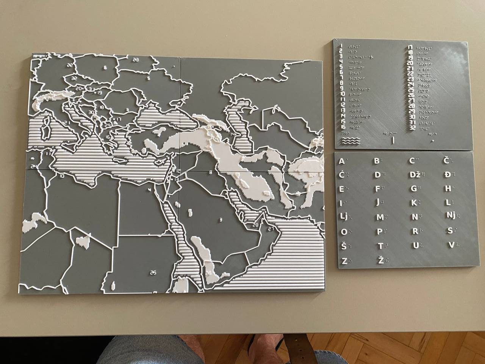
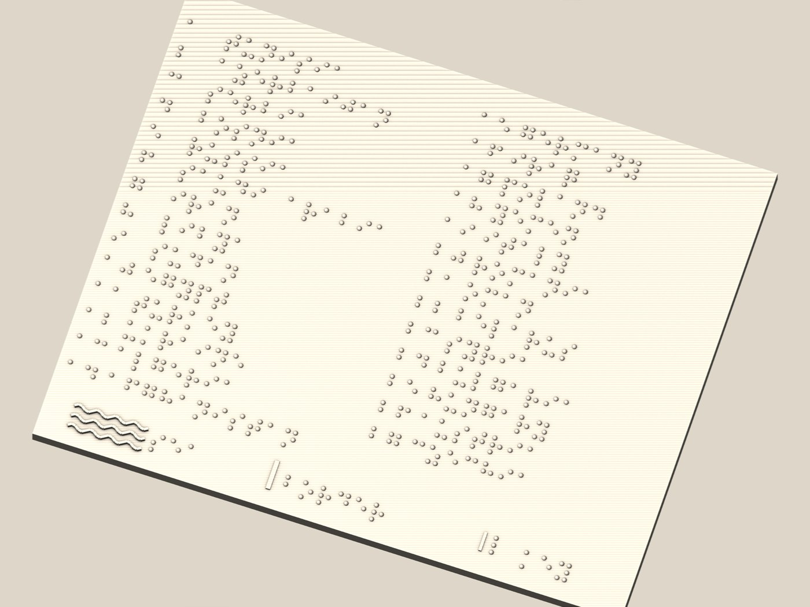
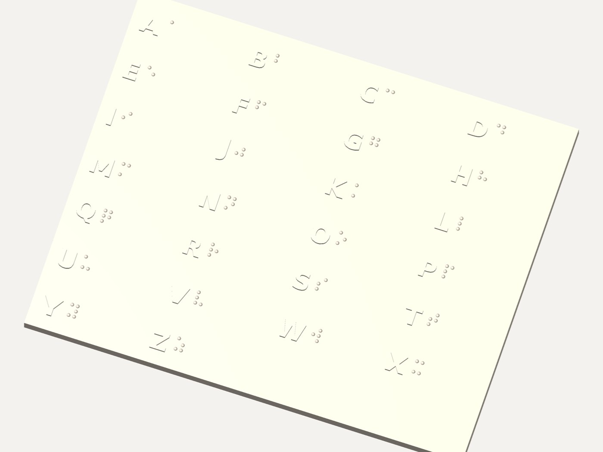
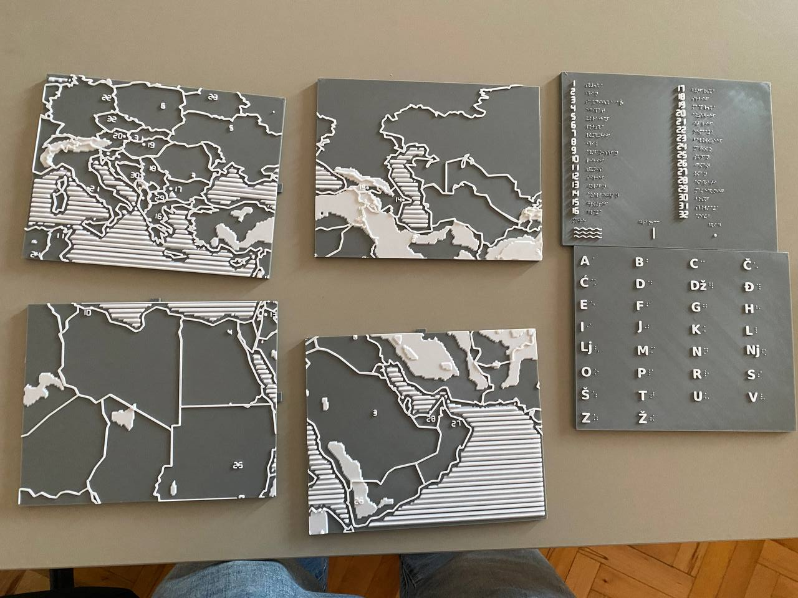
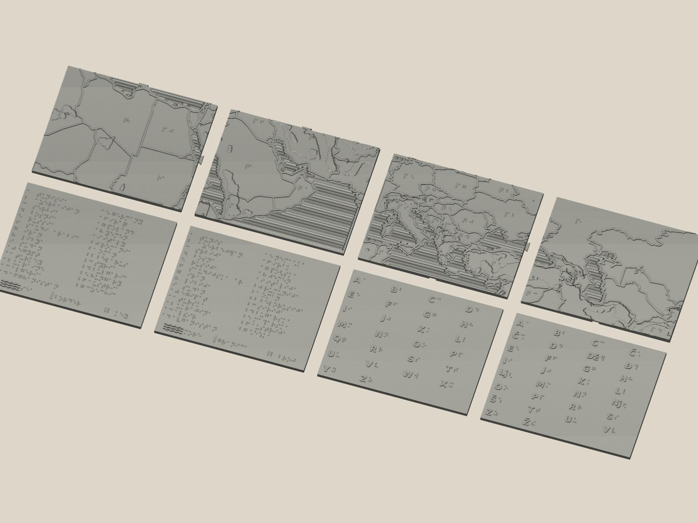
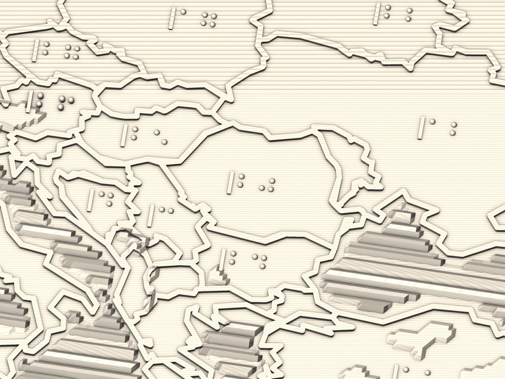
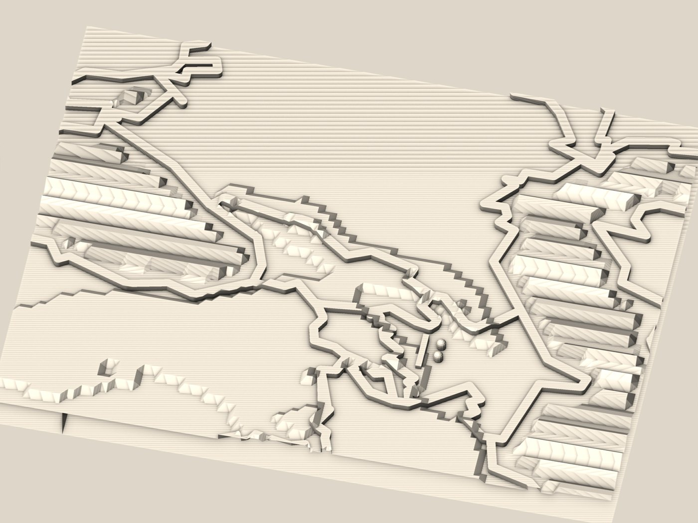
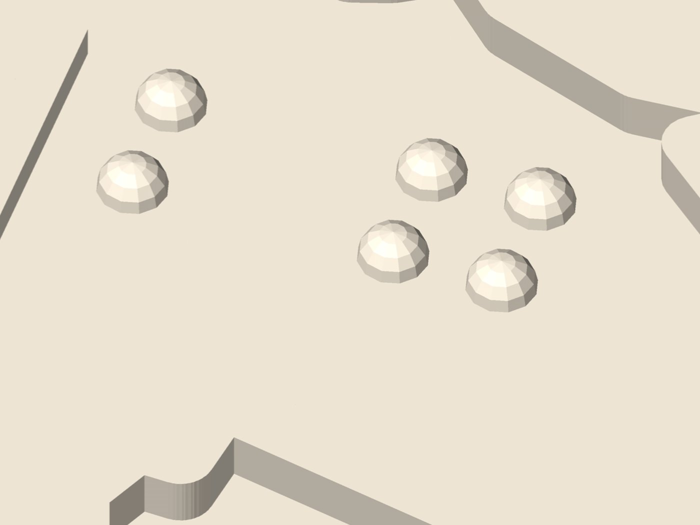

# World by Touch — a tactile map you read with your hands


A 3D-printable tactile map that helps blind people learn geography by touch.
Terrain, coastlines and borders are generated from real elevation and border
data, and country names are written in braille.

**[worldbytouch.com](https://worldbytouch.com)** — the story behind it, what a
blind reader's hands corrected in it, and how to have one made for another
region or another language.



## Why this exists

It began as a present for a friend of mine who is blind. The maps he could get
were either flat printed sheets that tell your fingers almost nothing, or museum
pieces you cannot take home. So this code turns real elevation and border data
into something a hand can read, and he got the first print.

Working through that print with him found two defects that were invisible on
screen, and both shaped the geometry this repository now generates:

| What the first print got wrong | What the code does now |
|---|---|
| Country labels were raised Arabic numerals — legible to me, unreadable to him, so every number had to be read out loud by somebody else | Labels are braille keys (`create_braille_number()` in `core/generate.py`), each with an anchor ridge on its left, so a single cell out on open ground still has a left edge and a baseline. The keys are the digit cells a–j *without* the ⠼ number sign — the space-saving convention for map keys — and the legend card pairs every key with its country name |
| Braille dots used the standard dimensions and printed as sharp points rather than domes, so a fingertip caught the tip and neighbouring dots blurred together | Every dot is a smooth dome on a buried skirt (`create_braille_dot()`): ⌀1.6 mm, 0.8 mm tall, Marburg Medium spacing — 2.5 mm between dots, 6 mm between cells |

The photographs in this README are that first print. The renders are the files as
they stand now. The two are not the same object, and the difference is the point.

## What is this?

This project generates STL files for 3D printing a tactile map. The map is
designed so a blind person can:

| What | How it feels |
|------|--------------|
| Country borders | Raised ridge (1.2 mm) that follows the terrain under the finger |
| Terrain | 4 tactile plateaus: sea / lowland / plateau / mountains (0/1/2/3 mm), cut at real 500 m and 1500 m elevation lines — all land sits at least 1 mm above the sea, so a coastline is always a step under the finger |
| Sea | Wavy texture |
| Country numbers | Braille key labels (Marburg Medium: ⌀1.6 mm dome dots, 2.5 mm dot pitch) with an anchor ridge that marks the cell frame; keys are digit cells without the ⠼ sign, resolved by the legend card |
| Legend | Braille country list + texture samples (sea, border, number key) |
| Alphabet cards | Raised Latin letter next to its braille cell, for learning braille |

The map splits into 4 puzzle pieces (200×160 mm each) that lock together with
dovetail tabs: lay one card flat, lower its neighbour onto the tab from above —
assembled, the map cannot slide apart. Legends and alphabet cards come in two languages: English and
Serbian (Gajica braille, 30 letters including Č Ć Dž Đ Lj Nj Š Ž).






## What You Get

9 print-ready STL files in `data/output/printready/`:

| File | Contents |
|------|----------|
| `tactile_map.stl` | The full 400×320 mm map in one piece |
| `card_1.stl` … `card_4.stl` | The same map split into 4 puzzle cards |
| `card_legend.stl` | Braille keys → country names in English braille |
| `card_legend_sr.stl` | Braille keys → country names in Serbian braille |
| `card_alphabet.stl` | English braille alphabet learning card (26 letters) |
| `card_alphabet_sr.stl` | Serbian braille alphabet learning card (30 letters) |



Every output is a single watertight two-manifold, verified by
`mesh_diagnostics.py` — no inverted normals, internal cavities, or
self-intersections.

Don't want to run any of this? The nine files are attached to the
[latest release](https://github.com/MAGLeb/worldbytouch/releases/latest), with
checksums, and the sliced plates are ready to print on
[MakerWorld](https://makerworld.com/en/models/3136316-tactile-braille-map-for-the-blind-europe-arabia).

## Region Covered

Europe, Middle East, North Africa, Caucasus: 5°–70° E, 12°–55° N.
27 countries get a braille number label, placed at the country's pole of
inaccessibility. Countries too small to hold a standard braille cell at a
readable clearance are left unlabelled — a braille cell is far larger than an
embossed digit, so fewer countries can carry one.



## How to Build

### 0. Install dependencies

```bash
python -m venv .venv && source .venv/bin/activate
pip install -r requirements.txt
```

### 1. Get the data

```bash
# Country borders (automatic, ~80 countries from geoBoundaries)
python core/prepare_data/download_geojson.py
python core/prepare_data/merge_geojson.py

# Elevation data (manual)
# Go to: https://www.ngdc.noaa.gov/mgg/global/
# Download ETOPO1_Bed_g_gmt4.grd
# Place in: data/input/
```

| Data | What for | Source |
|------|----------|--------|
| Country borders | Ridges between countries | [geoBoundaries](https://www.geoboundaries.org/) |
| Elevation | Terrain (mountains, plains) | [NOAA ETOPO1](https://www.ngdc.noaa.gov/mgg/global/) |

### 2. Generate STL files

```bash
python core/build_all.py
```

Output: `data/output/printready/` — the 9 STL files listed above.

### 3. Verify (optional)

```bash
python core/mesh_diagnostics.py
```

Prints a print-readiness report (watertight, normals, cavities,
self-intersections) for every STL.

### 4. Print

| Setting | Value | Note |
|---------|-------|------|
| Material | PLA | Common, cheap, safe |
| Infill | 15–20% | How solid inside (lower = faster) |
| Layer height | 0.2 mm | Each terrain plateau is exactly 5 layers |

## Project Structure

```
worldbytouch/
├── core/
│   ├── build_all.py           # ENTRY POINT: full print-ready build
│   ├── config.py              # Map region (bounding box)
│   ├── constants.py           # All tactile/physical parameters
│   ├── generate.py            # Mesh building blocks: terrain, water, borders,
│   │                          #   braille labels, legend card, dovetail tabs
│   ├── countries.py           # ISO3 -> country name table (EN/SR) for the labels
│   ├── walls_buffer.py        # Border ridges (buffer + manifold extrude)
│   ├── split_cards.py         # Boolean split into 4 puzzle cards
│   ├── heal_mesh.py           # Solid prep + boolean union helpers
│   ├── clean_mesh.py          # Topology cleanup -> watertight manifold
│   ├── text_mesh.py           # Raised Latin letters for alphabet cards
│   ├── alphabet_card.py       # Braille alphabet learning cards (EN/SR)
│   ├── serbian_braille.py     # Serbian Latin (Gajica) braille tables
│   ├── serbian_legend.py      # Serbian legend card
│   ├── mesh_diagnostics.py    # Print-readiness verification
│   ├── verify_labels.py       # Every braille label checked against its country
│   ├── export_3mf.py          # MakerWorld upload bundle (plated .3mf + STLs)
│   ├── render_previews.py     # Preview renders of the print-ready STLs
│   ├── render_label_check.py  # Contact sheet of every label, for eyeballing
│   ├── render_site_assets.py  # The renders published on worldbytouch.com
│   └── prepare_data/          # Data download & merge scripts
├── site/                      # worldbytouch.com – the published site itself
│   ├── index.html             # English
│   ├── sr/index.html          # Serbian
│   ├── style.css · favicon.svg
│   └── assets/                # Photos and renders used by the pages
├── docs/
│   ├── SITE.md                # How worldbytouch.com is edited and deployed
│   └── MAKERWORLD.md          # The MakerWorld listing text
├── assets/                    # Photos of the first print, used in this README
├── data/                      # Not in repo (too large)
│   ├── input/                 # ETOPO1 elevation grid
│   ├── countries/             # Downloaded border GeoJSONs
│   └── output/                # Generated files (printready/, previews_v2/,
│                              #   makerworld/)
├── functions/api/             # Cloudflare Pages Function behind the site's contact form
├── tools/stamp_css.py         # Cache-busting hash stamped into the CSS link on deploy
├── requirements.txt
└── README.md
```

## Tactile Design



| Parameter | Value |
|-----------|-------|
| Full map size | 400×320 mm nominal (398.9×318.8 as exported — the plate follows the elevation raster's cell centres) |
| Single card | 200×160 mm nominal; 204×164 mm printed footprint incl. dovetail tabs |
| Base thickness | 6 mm |
| Terrain plateaus | 0 / 1 / 2 / 3 mm (sea, lowland, plateau, mountains), banded at 0–500 / 500–1500 / >1500 m of real elevation |
| Border ridge | +1.2 mm above local terrain, 1.5 mm wide |
| Water waves | Sinusoidal swell up to 2 mm high, ~4 mm period (grid-sampled) |
| Braille dots | ⌀1.6 mm domes; 2.5 mm dot pitch, 6.0 mm cell pitch (Marburg Medium spacing). Dome height 0.8 mm — above the ~0.5 mm standard, deliberately: at standard height on FDM the first reader lost the dots |
| Label anchor ridge | 1.0 mm wide, full cell height, 1.4 mm clear of the dots |
| Puzzle connectors | Dovetail tabs 8→13 mm wide × 4 × 3 mm, 0.5 mm clearance, drop-in from above |

Key design decision: the border is a low ridge riding **on top of the local
terrain**, not a tall wall at a fixed height. A finger can trace a border
continuously and still read the relief on both sides of it; tall walls used to
bury small lowland countries entirely.



## Custom maps, collaboration, support

The map in this repository is free. Print it, adapt it, give it away.

What you cannot download is a region that does not exist here yet, a city, your
language, a classroom set or a museum panel — those I make to order:
**[worldbytouch.com](https://worldbytouch.com)**, or write to
[glebmaksimov@worldbytouch.com](mailto:glebmaksimov@worldbytouch.com) with the
region, who will read it and how many copies. A price and a timeline come back,
usually within two days.

For anything technical — printing problems, build errors, ideas —
[open an issue](../../issues).

If you would like to support future work on accessible 3D-printed materials,
[sponsorship](https://github.com/sponsors/MAGLeb) is welcome.

## License

MIT — see [LICENSE](LICENSE). The STL files it generates are yours to print,
adapt, and give away.
